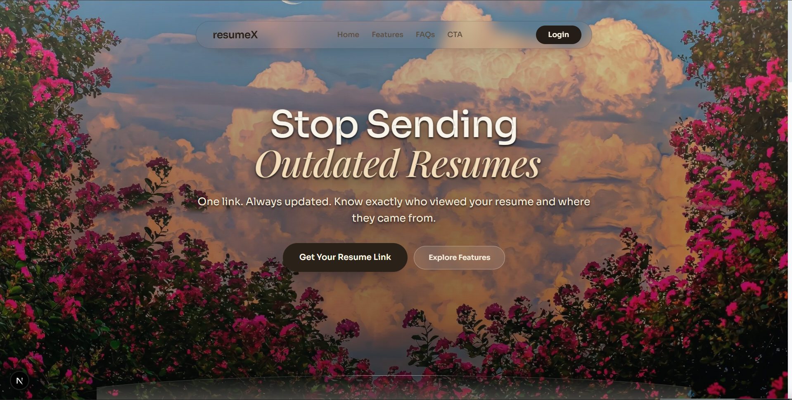
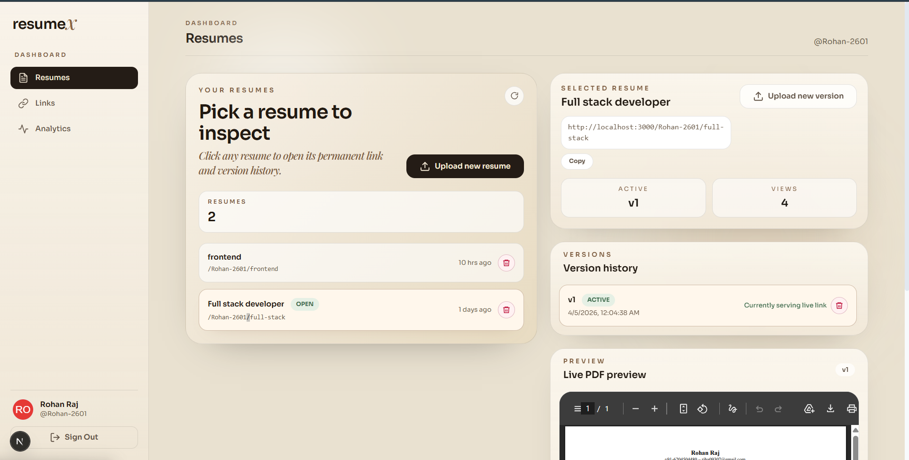
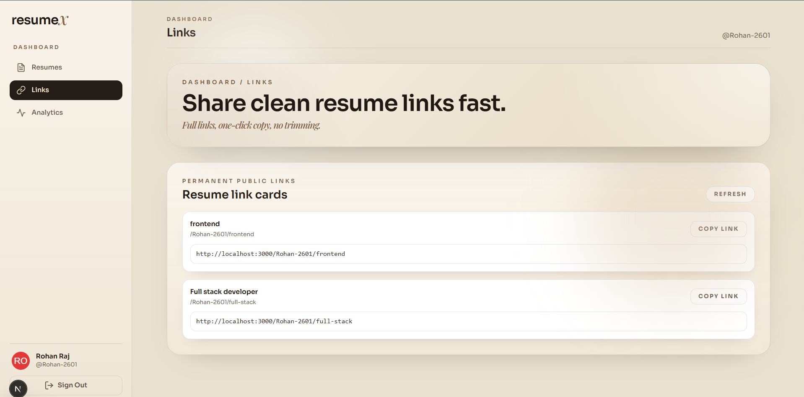
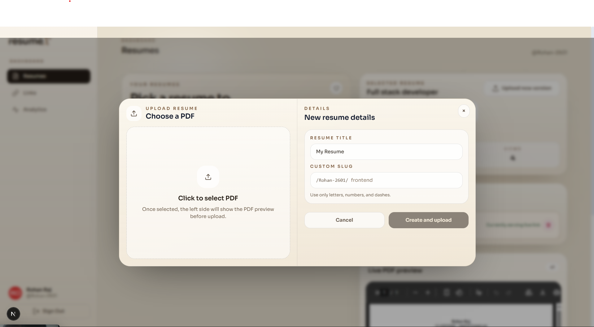
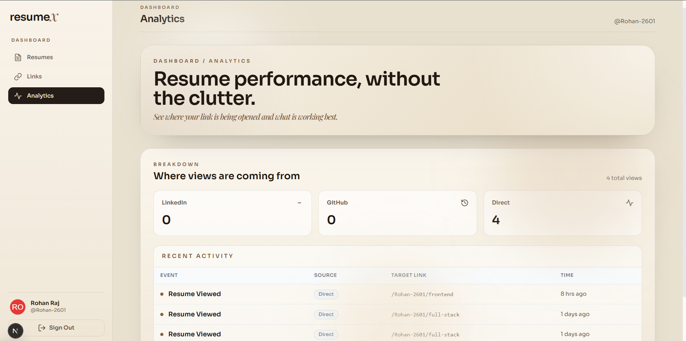

# resumeX

A GitHub-style system for resumes.

One link. Always updated.

---

## Why This Exists (The Real Problem)

I sent my resume to a recruiter.
Two days later I improved it.
Then the awkward question started:

- Should I send the updated PDF again?
- Did they already open the old one?
- Which version did I even send?

And if you are applying across roles, this gets messy fast:

- frontend resume
- backend resume
- fullstack resume
- AI/ML resume

Different files. Different links. No clean history. No visibility.

### What feels broken in the normal workflow

1. Resume links are usually file-specific, not identity-specific.
2. Updating a resume often means creating and re-sharing a new link.
3. There is no lightweight version trail for your own confidence.
4. You usually cannot tell if anyone opened your resume.

### What resumeX changes

resumeX treats your resume like code:

- Stable public links by username + slug
- Versioned resume uploads
- Rollback to older versions
- View tracking and source analytics

So instead of sending files around, you share a profile-like link once and keep improving behind the scenes.

---

## Core Product Idea

`resumeX` gives you:

1. One permanent public URL per role
2. Multiple role-based resume containers (e.g., `/rohan/frontend`, `/rohan/backend`)
3. A version timeline for each resume
4. Analytics to see whether your links are being opened and from where

This is the exact pain point it solves:

- You stop wondering, “Which resume did I send?”
- You stop re-sharing links after every update
- You get feedback via actual views, not guesswork

---

## Feature Overview

### Authentication

- GitHub OAuth login
- JWT-based session for protected dashboard APIs
- Frontend stores token in `localStorage`

### Resume Containers (Role-based)

- Create multiple resume containers with unique slugs per user
- Example: `frontend`, `backend`, `fullstack`, `ai-engineer`
- Slug uniqueness is enforced per user

### Version Control for Resumes

- Upload new PDF versions per resume
- System auto-increments version numbers (`v1`, `v2`, `v3`, ...)
- Mark latest version as active automatically
- Roll back active version to any previous version
- Delete specific versions safely

### Shareable Public Links

- Default profile: `/{username}`
- Role-specific profile: `/{username}/{slug}`
- Public pages render resume PDF through an embedded viewer

### Analytics

- Total views
- Source breakdown (LinkedIn, GitHub, Twitter, Direct)
- Recent activity feed
- Source inferred from request referrer

### SEO/Sharing Metadata

- Public pages generate Open Graph and Twitter metadata
- Attempts to generate preview image from first PDF page (Cloudinary URL transform pattern)

---

## Screenshots

These screenshots show the product in the order a recruiter or user would experience it.

### Landing Page



The first impression: a clean landing page that explains the product and invites login.

### Dashboard Overview



The protected workspace where resumes, links, and analytics live together.

### Shareable Links



This is where each role-based resume gets a stable shareable URL.

### Upload Modal



This is the versioning entry point for uploading a new resume or creating a new role-based container.

### Analytics



This view shows total views, traffic sources, and recent activity.

---

## Tech Stack

### Frontend

- Next.js (App Router)
- React
- Axios
- Tailwind CSS + custom styles

### Backend

- Node.js + Express
- MongoDB + Mongoose
- JWT authentication
- GitHub OAuth flow

### External Services

- GitHub OAuth (identity)
- Cloudinary (PDF hosting from frontend upload flow)
- Google Docs Viewer (public PDF display)

---

## Monorepo Structure

```text
resumeX/
  backend/
    src/
      app.js
      server.js
      config/db.js
      middleware/authMiddleware.js
      models/
        User.js
        Resume.js
        ResumeVersion.js
        View.js
      controllers/
        authController.js
        resumeController.js
        viewController.js
        publicController.js
      routes/
        authRoutes.js
        resumeRoutes.js
        analyticsRoutes.js
        viewRoutes.js
        publicRoutes.js
  frontend/
    app/
      page.js
      layout.js
      context/AuthContext.js
      dashboard/
      [username]/
      [username]/[slug]/
```

---

## How It Works Under The Hood

## 1) Authentication Lifecycle

1. User clicks login in frontend.
2. Frontend redirects to backend: `/api/auth/github`.
3. Backend redirects to GitHub OAuth authorize URL.
4. GitHub sends `code` back to backend callback.
5. Backend exchanges `code` for access token.
6. Backend fetches user profile + email from GitHub API.
7. Backend creates/fetches local `User` in MongoDB.
8. Backend signs JWT (`7d`) and redirects to frontend with token query param.
9. Frontend stores token in `localStorage`, removes token from URL, then fetches `/api/auth/me`.

Result: authenticated dashboard session.

## 2) Resume Data Model Strategy

There are four main collections:

1. **User**
- identity and username

2. **Resume**
- one role-based container
- has `slug` and `currentVersionId`
- unique index on `(userId, slug)`

3. **ResumeVersion**
- immutable version entries
- stores `fileUrl`, `versionNumber`, optional notes

4. **View**
- one tracked visit event
- stores `resumeId`, `versionId`, `slug`, `source`, timestamp, user agent, etc.

This design separates **identity**, **container**, **version history**, and **analytics events**.

## 3) Upload and Versioning Pipeline

1. User picks PDF in dashboard.
2. Frontend uploads PDF directly to Cloudinary.
3. Frontend sends Cloudinary `secure_url` to backend.
4. Backend finds latest version number for that resume.
5. Backend inserts new `ResumeVersion` with incremented number.
6. Backend updates `Resume.currentVersionId` to new version.

This gives append-only version history plus a single “active version pointer.”

## 4) Public Access and View Tracking

For public route `/{username}` or `/{username}/{slug}`:

1. Frontend page calls backend public API.
2. Backend resolves user + resume + current version.
3. Backend writes a `View` analytics event.
4. Backend returns `fileUrl`.
5. Frontend loads the PDF in an iframe viewer.

Important: tracking is tied to link access API call, so every successful fetch can generate a view event.

## 5) Analytics Aggregation

Dashboard analytics endpoint:

1. Collect all resume IDs owned by authenticated user
2. Count total views across those resume IDs
3. Aggregate source counts using MongoDB aggregation
4. Return recent view events sorted by newest first

This lets users understand whether link distribution is working.

---

## API Reference

Base URL examples:

- Local backend: `http://localhost:5000`
- Production backend: use your deployed backend URL

## Auth

- `GET /api/auth/github`  
  Redirects to GitHub OAuth.

- `GET /api/auth/github/callback`  
  Handles OAuth callback, then redirects to frontend with token.

- `GET /api/auth/me` (protected)  
  Returns current authenticated user.

## Resume Management (Protected)

- `POST /api/resume`  
  Create resume container with `{ title, slug }`.

- `GET /api/resume/me`  
  List all resumes for current user.

- `PATCH /api/resume/:resumeId/title`  
  Update title.

- `DELETE /api/resume/:resumeId`  
  Delete resume + versions + view records.

- `POST /api/resume/:resumeId/version`  
  Create new version with `{ fileUrl, notes? }`.

- `GET /api/resume/:resumeId/versions`  
  Fetch version timeline.

- `POST /api/resume/:resumeId/rollback/:versionId`  
  Point active version to older one.

- `DELETE /api/resume/:resumeId/version/:versionId`  
  Delete a version and reassign active version if needed.

## Public

- `GET /api/public/:username`  
  Resolve default resume + track view.

- `GET /api/public/:username/:slug`  
  Resolve slug resume + track view.

- `GET /api/public/:username/meta`  
  Metadata-only resolver (no PDF embed rendering logic in frontend).

- `GET /api/public/:username/:slug/meta`  
  Slug metadata resolver.

## Analytics

- `GET /api/analytics` (protected)  
  Returns total views, source distribution, recent views.

## Legacy / optional tracking route

- `POST /api/view/:username`  
  Explicit tracking endpoint exists; public routes also track views directly.

---

## Environment Variables

## Backend (`backend/.env`)

```env
PORT=5000
MONGO_URI=mongodb+srv://...
JWT_SECRET=your-super-secret

GITHUB_CLIENT_ID=...
GITHUB_CLIENT_SECRET=...

BACKEND_URL=http://localhost:5000
FRONTEND_URL=http://localhost:3000
# For multiple origins, comma-separate:
# FRONTEND_URL=http://localhost:3000,https://your-frontend-domain.com
```

## Frontend (`frontend/.env.local`)

```env
NEXT_PUBLIC_BACKEND_URL=http://localhost:5000

NEXT_PUBLIC_CLOUDINARY_CLOUD_NAME=your_cloud_name
NEXT_PUBLIC_CLOUDINARY_UPLOAD_PRESET=your_unsigned_upload_preset
```

---

## Local Development Setup

### 1. Install dependencies

From repo root:

```bash
npm install
```

### 2. Configure environment files

- Create `backend/.env`
- Create `frontend/.env.local`
- Add values from the sections above

### 3. Start both apps

From repo root:

```bash
npm run dev
```

This runs:

- backend on `http://localhost:5000`
- frontend on `http://localhost:3000`

### 4. Build production frontend

```bash
npm run build
npm run start
```

---

## Typical User Journey

1. Login with GitHub
2. Create role-based resume containers (`frontend`, `backend`, etc.)
3. Upload PDF versions over time
4. Share one stable link per role
5. Recruiters open link, latest active version is served
6. You check analytics and iterate

---

## Design Decisions and Trade-offs

### Why separate `Resume` and `ResumeVersion`?

Because role identity and file history are different concerns.

- `Resume`: stable addressable entity (`slug`)
- `ResumeVersion`: historical immutable snapshots

### Why use `currentVersionId` pointer?

Fast read for public traffic.
No need to compute latest version on every request.
Rollback is a pointer update, not a file move.

### Why infer source via referrer?

Simple, low-friction analytics without extra query params.
Trade-off: referrer can be missing/blocked; then source becomes `Direct`.

### Why Cloudinary + URL storage?

Backend stays lightweight and stateless for file bytes.
It only stores URLs and metadata.

---

## What Problem This Solves Better Than “Just Sending PDFs”

- **Reduces version confusion**: you always know what is active.
- **Improves distribution confidence**: one link per role.
- **Adds visibility**: view analytics create signal.
- **Encourages iteration**: update anytime without link churn.

In short: your resume workflow becomes a system, not a folder of files.

---

## Known Limitations

1. View tracking is request-based and may count repeated opens.
2. Public viewer relies on embedded rendering availability.
3. No built-in deduplication for unique visitor analytics yet.
4. Notes field exists for versions, but dashboard usage can be expanded.

---

## Roadmap Ideas

- Unique visitor estimates and bot filtering
- Per-resume analytics dashboard split
- A/B resume experiments by channel
- Optional custom domains
- Team/workspace mode for referrals and agencies
- Resume diff view between versions

---

## Security Notes

- Protected APIs require JWT Bearer token.
- CORS allowlist is enforced from `FRONTEND_URL`.
- OAuth secrets and JWT secret must stay in server env only.
- Use strong secrets and production HTTPS in deployment.

---

## If You Are Building This Further

High-impact next upgrades:

1. Add test coverage for auth and versioning edge cases.
2. Add rate limiting on public and auth endpoints.
3. Add structured event schema for analytics enrichment.
4. Add better error telemetry and audit logging.

---

## Final Thought

A resume is not static anymore.

You improve every week.
Your links should not break every week.

resumeX gives your career documents the same thing code already has:

- stable addresses
- version history
- measurable usage

That one shift removes a lot of hidden friction from job applications.
